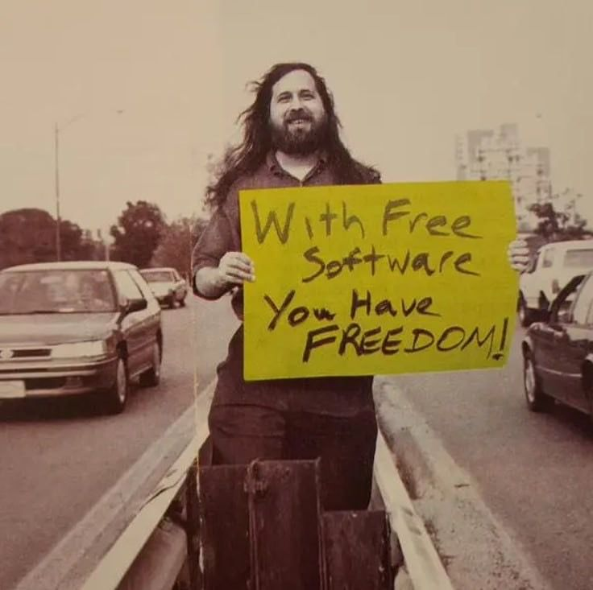

<div align="center">

  <h1>odxnoj-sh</h1>

  <p><i>I'm a tech kiddo interested in UNIX & POSIX systems</i></p>

  <p>
    <a href="#"></a>
    <a href="#"></a>
    <a href="#"></a>
  </p>

  <br />

  <p>
    
  </p>

  <p>
    
  </p>

</div>

<br />

```c
/* Write programs that do one thing and do it well.
   Write programs to work together. */
